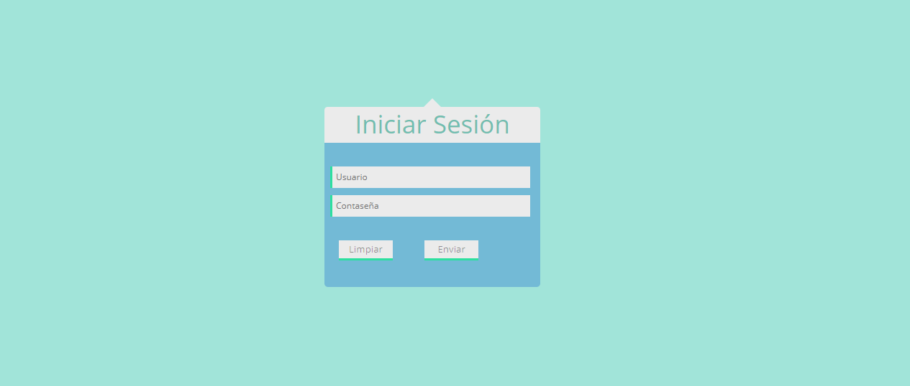
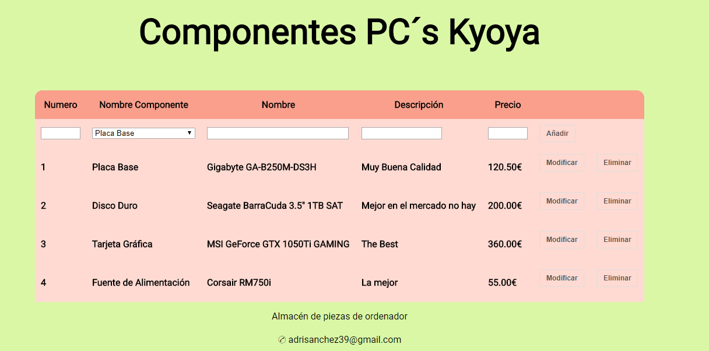
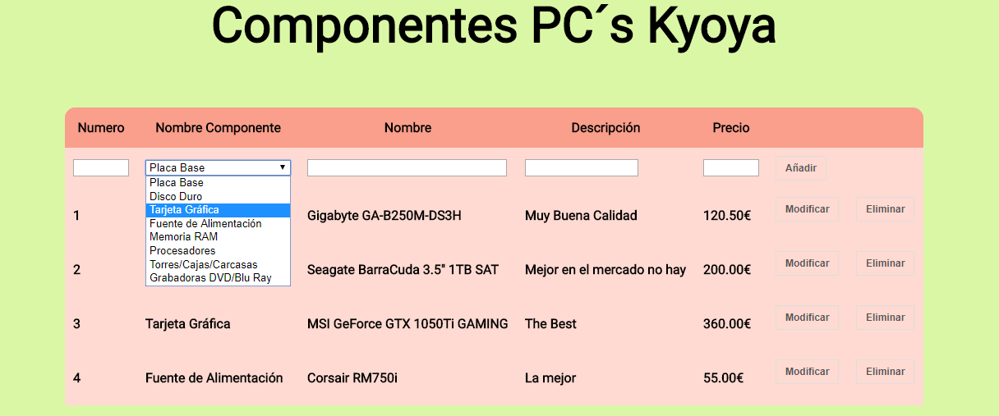

# Crud-II

Ejercicio CRUD II en JSP y MySQL sobre gestion de un almacen de componentes de ordenador.

Página de inicio de sesión 

Página principal del Crud

Página de modificación del Crud

Página que muestra el ArrayList

